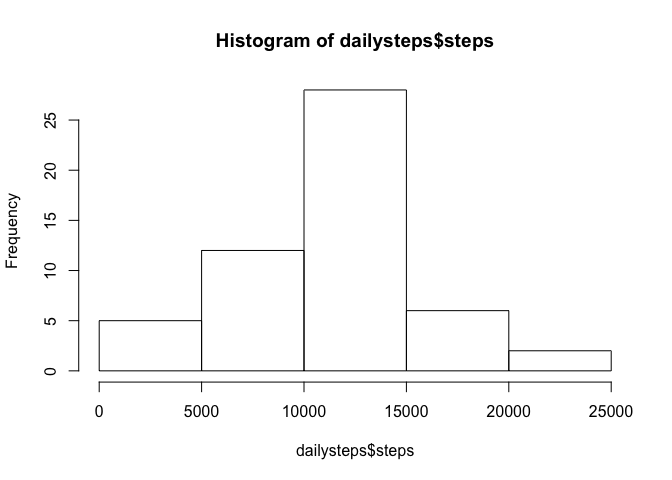
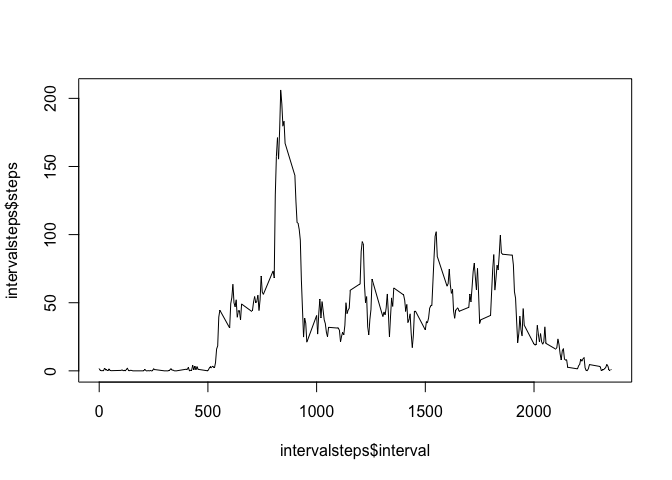
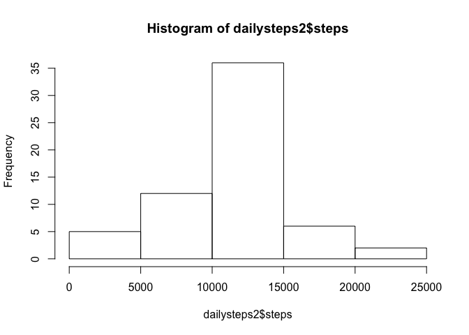
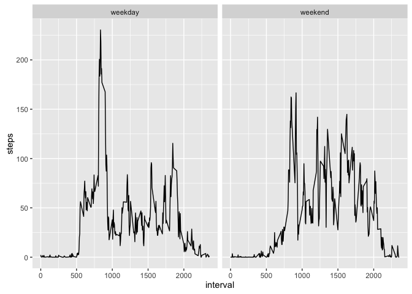

# Reproducible Research: Peer Assessment 1


## Loading and preprocessing the data
In this section the data is loaded from the source file and the date column is converted from string to date.


```r
activity <- read.csv("~/RepData_PeerAssessment1/activity.csv", stringsAsFactors=FALSE)
activity$date <- as.Date(activity$date)
```


## What is mean total number of steps taken per day?
I use the aggregate function to find the total steps for each date. Then generate a histogram and report the mean and median.


```r
dailysteps <- aggregate(steps ~ date, data = activity, FUN=sum)
hist(dailysteps$steps)
```

 

```r
mean(dailysteps$steps)
```

```
## [1] 10766.19
```

```r
median(dailysteps$steps)
```

```
## [1] 10765
```


## What is the average daily activity pattern?
Again using the aggregate function, I find the mean number of steps for a given interval. Then I create a line plot and use which.max to find the interval with the greatest mean.

```r
intervalsteps <- aggregate(steps ~interval, data = activity, FUN=mean)
plot(intervalsteps$interval, intervalsteps$steps, type="l")
```

 

```r
index <- which.max(intervalsteps$steps)
intervalsteps$interval[index]
```

```
## [1] 835
```
## Imputing missing values
First, report the number of incomplete cases in activity

```r
ok <- complete.cases(activity)
sum(!ok)
```

```
## [1] 2304
```
Next, imput the missing values using the mean for the interval.

```r
activity2 <- activity
for (i in 1:length(activity2$steps)) {
  if (is.na(activity2$steps[i])) {
    activity2$steps[i] <- intervalsteps[intervalsteps$interval == activity$interval[i],2]
  }
}
```
Reproducing the original histogram, mean and median with the imputted values results in eight more days in the medial range, an unchanged mean and a median that exactly matches the mean.

```r
dailysteps2 <- aggregate(steps ~ date, data = activity2, FUN=sum)
hist(dailysteps2$steps)
```

 

```r
mean(dailysteps2$steps)
```

```
## [1] 10766.19
```

```r
median(dailysteps2$steps)
```

```
## [1] 10766.19
```


## Are there differences in activity patterns between weekdays and weekends?

```r
for (i in 1:length(activity2$steps)) {
  if (weekdays(activity2$date[i]) == "Saturday"|weekdays(activity2$date[i]) == "Sunday") {
    activity2$day[i] <- "weekend"}
  else{
    activity2$day[i] <- "weekday" }
}

activity2$day <- factor(activity2$day)
intervalsteps2 <- aggregate(steps ~ interval + day, data = activity2, FUN = mean)
library(ggplot2)
```

```
## Warning: package 'ggplot2' was built under R version 3.2.3
```

```r
qplot(interval, steps, data=intervalsteps2, facets=.~day, geom="line")
```

 
When we analyze the weekday and weekend data separately, we find that activity is far more evenly distributed on weekends and does not show the single obvious peak we see on weekends.
